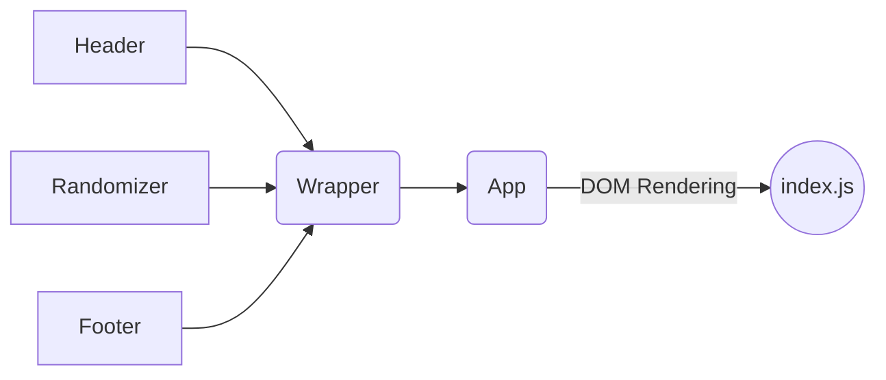

# Generating Non-Repetitive Random Number using React

This repository is not for public use. It is only for the demo purpose.
Demo of the application can be accessed by [clicking here](https://lovleshpokra.github.io/random-number/)

## Tech Stack / Modules Used

|Package| Description |
|--|--|
|react| Core React Library
|react-dom| This is used for serving to react application to DOM.
|react-scripts| For running react application, this package is shipped with create-react-app
|eslint| Used for Formating and Linting of Code


## The Application
- The application shows a number between 1 and 15000 on-screen.  
- For every 2 seconds, it calculates the number between the range 1 to 15000 that is configurable.  
- It shows this new number every 2 seconds on screen.


## Application Architecture

Application architecture is flexible for any React.js application. As this function does not have complexity, so It was created using React's 'create-react-app' CLI. The folder structure of the application is as follows.
```
app
├── src
│   ├── assets
│		├── images
│       	├── icons
│   ├── components
│		├── footer
│       │   ├── Footer.js
│       │   └── index.js
│		├── header
│       │   ├── Header.js
│       │   └── index.js
│		├── randomizer
│       │   ├── Randomizer.js
│       │   └── index.js
│		├── wrapper
│       │   ├── Wrapper.js
│       │   └── index.js
├── shared
│   └── utils
│       └── index.js
├── App.js
├── App.css
└── index.js
```

**Applicate Flow:**

